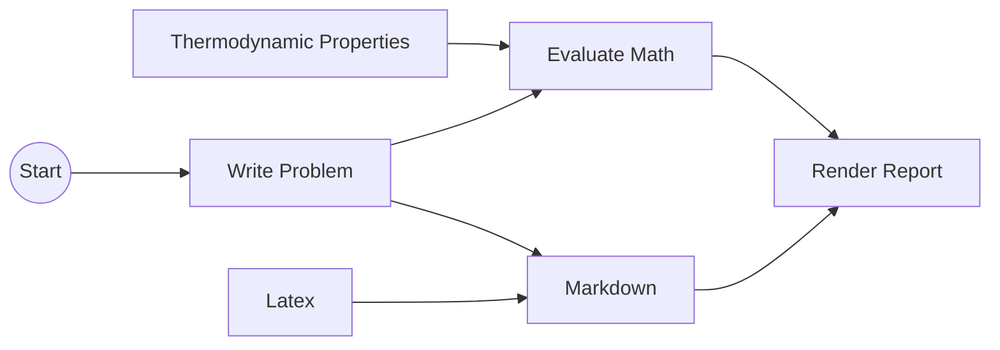

# Web Thermodynamics
This is a simple example of how to run CoolProp Javascript wrapper with units handled by mathjs.

# Basic example

It loads with three example expressions for each of the CoolProp functions available:

* *Density* of **nitrogen** at a *temperature* **25 °C** and a *pressure* **1 atmosphere**: `props('D', 'Nitrogen', {T:25 degC, P:1 atm})`
  ```
  1.1452448929367 kg / m^3
  ```
* *Phase* of **water** at a *pressure* of **1 atmosphere** and **0%** *Quality*: `phase('Water', {P:1 atm, Q: 0 %})`
  ```
  twophase
  ```
* *Enthalpy* $[\frac{J}{kg_{dry\ air}}]$ as a function of *temperature*, *pressure* and *relative humidity* at STP `HAprops('H', {T: 25 degC, P:1 atm, R:90 %})`
  ```
  50423.450391029 J / kg
  ```

On this example we mix the putouts with **markdown** and equations with **latex** if we start the comment with a `# ` this is a nice way to make present the results including some input markdown.

# Getting started

Open this link:

https://dvd101x.github.io/web-thermodynamics/

# How does it work




# Intermediate example

This demo uses libraries with many capabilities. There are many conversions available for inputs and ouputs and the results can be stored on variables, arrays and objects to be used later.

``` python
# Density of carbon dioxide at 100 bar and 25C in lbm/in^3
rho = props('D', 'CO2', {T:25 degC, P:100 bar}) in lbm/in^3

# Saturated vapor enthalpy [J/kg] of R134a at 25C
enthalpy = props('H', 'R134a', {T:25 celsius, Q:100%})

# Enthalpy (J per kg dry air) as a function of temperature, pressure, 
#    and relative humidity at STP
enthalpyDry = HAprops('H', {T:298.15 K, P:101325 Pa, R:0.5})

# Create an array with empty objects
cycle = [{},{}];

# Temperature of saturated air at the previous enthalpy
cycle[1].T = HAprops('T', {P:1 atm, H:enthalpyDry, R:1.0})

# Temperature of saturated air in farenheit
cycle[2].T = HAprops('T', {H:enthalpyDry, R:1.0, P:1 atm}) to degF

```
Shall return:
```javascript
0.029538663149234 lbm / in^3
4.1233395323187e+5 J / kg
50423.450391029 J / kg
290.96209246917 K
64.0617664445 degF
[17.812092469167 degC, 17.812092469167 degC]
```

# Advanced examples

It can solve many other problems based con [CoolProp High Level API documentation](http://www.coolprop.org/coolprop/HighLevelAPI.html#high-level-api):

```python
# Saturation temperature of Water at 1 atm in K
props('T', 'Water', {P:101325 Pa, Q: 0})

# Saturated vapor enthalpy of Water at 1 atm in J/kg
H_V = props('H', 'Water', {P:101325 Pa, Q: 1})

# Saturated liquid enthalpy of Water at 1 atm in J/kg
H_L = props('H', 'Water', {P:101325 Pa, Q: 0})

# Latent heat of vaporization of Water at 1 atm in J/kg
H_V - H_L
# Get the density of Water at T = 461.1 K and P = 5.0e6 Pa, imposing the liquid phase
props('D', 'Water', {'T|liquid':461.1 K, P: 5e6 Pa})

# Get the density of Water at T = 597.9 K and P = 5.0e6 Pa, imposing the gas phase
props('D', 'Water', {T:597.9 K, 'P|gas': 5e6 Pa})

# You can call the props function directly using an empty object:
props('Tcrit', 'Water', {})

# It can be useful to know what the phase of a given state point is
phase('Water', {P:101325 Pa, Q:0})

# The phase index (as floating point number) can also be obtained using the props function:
props('Phase', 'Water', {P:101325 Pa, Q: 0})

# c_p using c_p
props('C', 'Water', {P:101325 Pa, T: 300 K})

# c_p using derivate
props('d(Hmass)/d(T)|P', 'Water', {P:101325 Pa, T: 300 K})

# c_p using second partial derivative
props('d(d(Hmass)/d(T)|P)/d(Hmass)|P', 'Water', {P:101325 Pa, T: 300 K})
```
Shall return
```javascript
373.12429584768 K
2.6755293255007e+6 J / kg
4.1905773309408e+5 J / kg
2.2564715924067e+6 J / kg
881.00085333474 kg / m^3
20.50849607058 kg / m^3
647.096 K
twophase
6
4180.6357765552 J / (kg K)
4180.6357765552 J / (kg K)
-7.7679894680327e-5 (J kg) / (kg K J)
```

These concepts can be used to calculate complete thermodyinamic cycles.

``` python
# # Vapor compression cycle
# Specifies all states of a typical vapor compression cycle

# ## Inputs
# 
# Fluid and mass flow
fluid = 'R134a'
mDot  = 1 kg/minute

# Component data
evap  = {T: -20 degC, P_drop: 0 Pa, superHeating: 10 K}
cond  = {T:  40 degC, P_drop: 0 Pa, subCooling  : 10 K}
etaS  = 0.75

# ## Process

#- Define an empty array to add the cycle steps
c = [];

#- Make a function for this specific fluid
p(desiredProperty, currentState) = props(desiredProperty, fluid, currentState);

#- Define low and high pressure
pLow  = p('P', {T: evap.T, Q: 100%});
pHigh = p('P', {T: cond.T, Q: 0%  });

# 4 to 1 Evaporation
c[1] = {};
c[1].P = pLow;
c[1].T = evap.T+ evap.superHeating;
c[1].D = p('D', c[1]);
c[1].H = p('H', c[1]);
c[1].S = p('S', c[1]);
c[1]

# 1 to 2 Compression of vapor
c[2] = {};
c[2].P = pHigh;
H_i        = p('H',{P:c[2].P, S:c[1].S});
c[2].H = (H_i-c[1].H)/etaS + c[1].H;
c[2].T = p('T', c[2]);
c[2].D = p('D', c[2]);
c[2].S = p('S', c[2]);
c[2]

# 2 to 3 Condensation
c[3] = {};
c[3].P = c[2].P - cond.P_drop;
c[3].T = cond.T-cond.subCooling;
c[3].D = p('D', c[3]);
c[3].H = p('H', c[3]);
c[3].S = p('S', c[3]);
c[3]

# 3 to 4 Expansion
c[4] = {};
c[4].H = c[3].H;
c[4].P = c[1].P + evap.P_drop;
c[4].T = p('T', c[4]);
c[4].D = p('D', c[4]);
c[4].S = p('S', c[4]);
c[4]

# ## Work, Energy and Performance
# $W_{comp}$
W_comp   = mDot*(c[2].H - c[1].H)

# $Q_h$
Q_h      = mDot*(c[2].H - c[3].H)
# $Q_c$
Q_c      = mDot*(c[1].H - c[4].H)

# $COP_{evaporator}$
evap_COP = Q_c/W_comp

# $COP_{condenser}$
cond_COP = Q_h/W_comp

# # Final results

print('Compressor power   : $0 \t$1\t$2', W_comp to [W, BTU/h, TR], 4)
print('Condenser heat out : $0 \t$1\t$2', Q_h    to [W, BTU/h, TR], 4)
print('Evaporator heat in : $0 \t$1\t$2', Q_c    to [W, BTU/h, TR], 4)

print('COP(cooling)       : $0', [evap_COP], 3)
print('COP(heating)       : $0', [cond_COP], 3)
```
Shall return:

``` javascript
R134a
1 kg / minute
{"T": -20 degC, "P_drop": 0 Pa, "superHeating": 10 K}
{"T": 40 degC, "P_drop": 0 Pa, "subCooling": 10 K}
0.75
Compressor power   : 992.1 W 	3385 BTU / h	0.2821 TR
Condenser heat out : 3542 W 	12090 BTU / h	1.007 TR
Evaporator heat in : 2550 W 	8701 BTU / h	0.7251 TR
COP(cooling)       : 2.57
COP(heating)       : 3.57
```

# Additional features

Here is a similar project [Engineering-Solver](https://github.com/dvd101x/Engineering-Solver) that includes additional features:

* Saves in the browser (you can continue where you left off)
* 9 workspaces, so you can try different things
* Uses a webworker to avoid freezing during big calculaitons
* A few more examples focused on the many features of mathjs

# Dependancies

Uses the following js libraries

* Calculations
  * [Mathjs](https://mathjs.org/)
  * [CoolProp](http://www.coolprop.org/)
* Editing
  * [CodeMirror 5](https://codemirror.net/5/)
* Rendering results
  * [Markdown-it](https://github.com/markdown-it/markdown-it)
  * [markdown-it-katex](https://github.com/waylonflinn/markdown-it-katex)
  * [katex](https://katex.org/)

# References

* [Example of fluid properties function **props** and **phase**](http://coolprop.sourceforge.net/coolprop/HighLevelAPI.html#high-level-api)
* [List of fluids](http://coolprop.sourceforge.net/fluid_properties/PurePseudoPure.html#list-of-fluids)
* [List of fluid properties](http://www.coolprop.org/coolprop/HighLevelAPI.html#table-of-string-inputs-to-propssi-function)
* [Example of psychrometric function **HAprops**](http://coolprop.sourceforge.net/fluid_properties/HumidAir.html#sample-hapropssi-code)
* [List of psychometric properties](http://coolprop.sourceforge.net/fluid_properties/HumidAir.html#table-of-inputs-outputs-to-hapropssi)
* [List of units](https://mathjs.org/docs/datatypes/units.html#reference)
* [List of extra functions](https://mathjs.org/docs/reference/functions.html)
* [Syntax](https://mathjs.org/docs/expressions/syntax.html)
